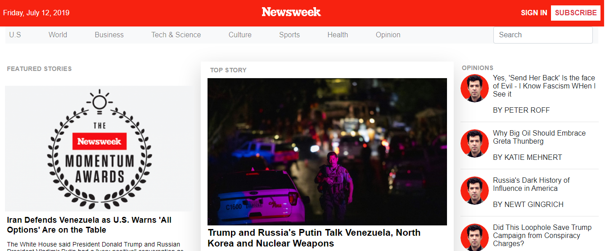
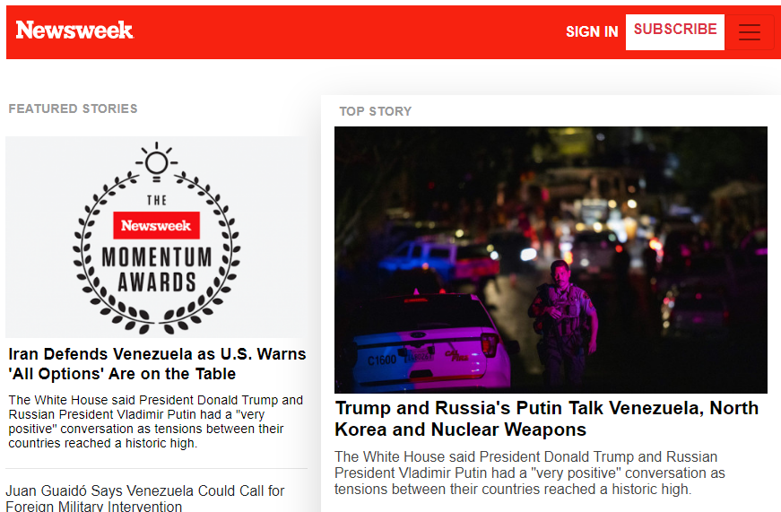

# USING BOOTSTRAP

> A practical demonstration of designing a website with bootstrap framework.
This project is designed to look like [newsweek.com's news website](https://www.newsweek.com/), for the purpose of practical demonstration.
The project is part of a series of projects to be completed by students of [Microverse](https://www.microverse.org/ "The Global School for Remote Software Developers!").

## Technologies

- HTML
- CSS
- BOOTSTRAP

## Screenshot

### Laptop/Desktop


### Tablet


### Mobile


### Live version

* [Live Version](https://addod19.github.io/using-bootstrap/)

## Getting Started

To get a local copy up and running follow these simple example steps.

1. ``` git clone https://github.com/addod19/using-bootstrap.git ```
2. Open the index.html with your favorite browser
3. Explore our site
4. Enjoy the beauty of responsive design

### Prerequisites

- A modern browser

### Future Update(v1.2)

- Add animations
- Add javascript validation
- Improve the UI

## Authors

👤 **Author1**

- Github: [@addod19](https://github.com/addod19)
- Twitter: [@DanielLarbiAdd1](https://twitter.com/DanielLarbiAdd1)
- Linkedin: [Daniel Larbi Addo](https://linkedin.com/in/daniel-larbi-addo/)
- Email: (addodaniellarbi@gmail.com)

## 🤝 Contributing

Contributions, issues and feature requests are welcome!

Feel free to check the [issues page](https://github.com/addod19/using-bootstrap/issues).


1. Fork it (https://github.com/addod19/using-bootstrap/fork)
2. Create your feature branch (git checkout -b my-new-feature)
3. Commit your changes (git commit -am 'Add some feature')
4. Push to the branch (git push origin my-new-feature)
5. Create a new Pull Request


## License

This project is licensed under the MIT License - see the [LICENSE](./LICENSE.md) file for details


## Show your support

Give us a ⭐️ if you like this project!

## Acknowledgments

- Microverse
- Microverse TSE's

